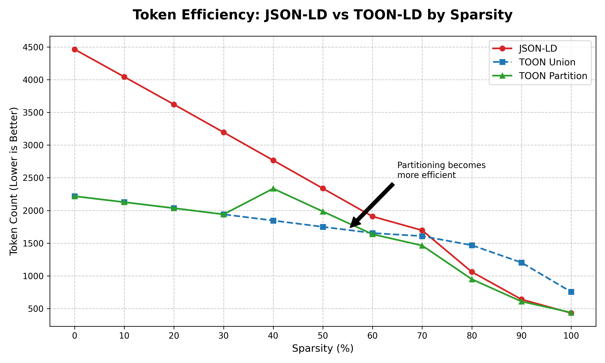
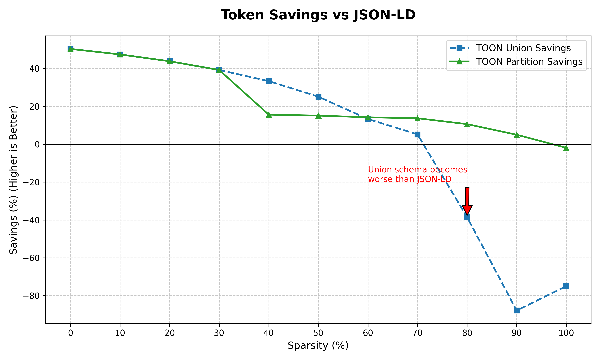

# TOON-LD

[](https://www.npmjs.com/package/toon-ld)
[](https://pypi.org/project/toon-ld/)
[](https://crates.io/crates/toon-ld)

**Token-Oriented Object Notation for Linked Data** — A lossless **Knowledge Graph Compression** format for LLM Context Windows.

TOON-LD reduces token usage by **40-60%** compared to JSON-LD, allowing you to fit twice as much structured data into your prompts for RAG (Retrieval-Augmented Generation) applications.

It works by extending standard TOON syntax with Linked Data semantics, meaning **every valid TOON-LD document is also a valid TOON document**. Base TOON parsers can process it natively, while TOON-LD processors unlock the full semantic graph.

## Why TOON-LD?

**The Problem:** Knowledge Graphs (JSON-LD) are incredibly verbose. Using them in RAG pipelines burns through token budgets and hits context limits fast.

**The Solution:** TOON-LD acts as a compression layer. It combines the semantic expressiveness of RDF with radical token efficiency through tabular arrays. By eliminating repetitive keys and using CSV-like rows for uniform data, TOON-LD fits significantly more information into LLM context windows without losing structure.

## Features

- **Pure TOON Extension**: Every TOON-LD document is valid TOON (like JSON-LD extends JSON)
- **Tabular Arrays**: Serialize arrays of objects as CSV-like rows with shared headers
- **40-60% Token Reduction**: Fewer tokens means lower costs and more data in context
- **JSON-LD Preservation**: Preserves JSON-LD structures without implementing JSON-LD expansion/compaction itself
- **JSON-LD 1.1 Structures**: Preserves `@context`, `@graph`, `@id`, `@type`, value nodes, lists, and other JSON-LD structures
- **Cross-Platform**: Rust, WebAssembly (npm), and Python (PyPI) implementations
- **High Performance**: Optimized serialization with automatic tabular array detection

## Benchmarks

Real-world token savings across different dataset sizes:

| Records | JSON-LD Size | TOON-LD Size | Size Saved | Tokens Saved |
|---------|--------------|--------------|------------|--------------|
| 10      | 862 B        | 518 B        | **39.9%**  | **54.2%**    |
| 100     | 8,782 B      | 5,109 B      | **41.8%**  | **56.3%**    |
| 1,000   | 90,682 B     | 53,710 B     | **40.8%**  | **56.5%**    |
| 10,000  | 936,682 B    | 566,711 B    | **39.5%**  | **53.4%**    |

**Key takeaway**: Token savings scale well and are especially valuable for LLM context windows.

### Sparsity Analysis

TOON-LD's efficiency depends on data sparsity. Shape-based partitioning (enabled by default) ensures TOON-LD remains efficient even for highly heterogeneous data.





- **Low Sparsity (0-30%)**: Both Union and Partition approaches save ~40-50% tokens.
- **High Sparsity (60%+)**: Partitioning significantly outperforms the Union schema, maintaining efficiency where standard tabular formats fail.

#### Token Cost Analysis

**Union Schema**: High cost when `null_count` is large (sparse data).
**Partitioned Schema**: Low cost when partitions have dense, non-overlapping fields.

**Break-even point**: ~30% sparsity threshold balances both approaches.

**Partitioning excels when:**
- High field diversity (heterogeneous graphs)
- Large datasets
- Mixed entity types

## Quick Example

**JSON-LD:**
```json
{
  "@context": {
    "foaf": "http://xmlns.com/foaf/0.1/"
  },
  "@graph": [
    {"@id": "ex:1", "@type": "foaf:Person", "foaf:name": "Alice", "foaf:age": 30},
    {"@id": "ex:2", "@type": "foaf:Person", "foaf:name": "Bob", "foaf:age": 25}
  ]
}
```

**TOON-LD:**
```
@context:
  foaf: http://xmlns.com/foaf/0.1/
@graph[2]{@id,@type,foaf:age,foaf:name}:
  ex:1, foaf:Person, 30, Alice
  ex:2, foaf:Person, 25, Bob
```

Notice how object keys appear once in the header instead of repeating for each object.

## How TOON-LD Extends TOON

Just as JSON-LD extends JSON by adding semantic meaning to certain key names (those starting with `@`), TOON-LD extends TOON the same way:

- **No new syntax**: TOON-LD uses only standard TOON syntax (objects, arrays, tabular format)
- **Semantic interpretation**: Keys like `@context`, `@id`, `@type` have special JSON-LD meaning
- **Full compatibility**: Any TOON parser can parse TOON-LD documents
- **Value nodes**: Language tags and datatypes use tabular format for efficiency

Example value node with language tag:
```
title[2]{@value,@language}:
  The Hobbit,en
  Der Hobbit,de
```

This is standard TOON tabular syntax that base TOON parsers handle natively, while TOON-LD processors interpret it as JSON-LD value nodes.

## Installation

### Rust
```toml
[dependencies]
toon-ld = "0.2"
```

### CLI
```bash
cargo install toon-cli
```

### Python
```bash
pip install toon-ld
```

### JavaScript/TypeScript
```bash
npm install toon-ld
```

## Quick Start

### CLI
```bash
# Convert JSON-LD to TOON-LD
toon-ld convert -i data.jsonld -o data.toon

# Convert back to JSON-LD
toon-ld convert -i data.toon -o data.jsonld

# Run benchmark
toon-ld benchmark --max-records 10000
```

### Rust
```rust
use toon_ld::{encode, decode};

let json_ld = r#"{"@context": {"foaf": "http://xmlns.com/foaf/0.1/"}, "foaf:name": "Alice"}"#;
let toon = encode(json_ld)?;
let back = decode(&toon)?;
```

### Python
```python
import toon_ld

json_ld = '{"@context": {"foaf": "http://xmlns.com/foaf/0.1/"}, "foaf:name": "Alice"}'
toon_str = toon_ld.encode(json_ld)
json_str = toon_ld.decode(toon_str)
```

### JavaScript
```javascript
import { encode, decode, parse, stringify } from 'toon-ld';

// String conversion
const jsonLd = '{"@context": {"foaf": "http://xmlns.com/foaf/0.1/"}, "foaf:name": "Alice"}';
const toon = encode(jsonLd);
const json = decode(toon);

// Object helpers
const data = parse(toon); // Returns JS Object
console.log(data['foaf:name']); // "Alice"

const toonStr = stringify({ "foaf:name": "Bob" }); // Takes JS Object
```
 

## Key Concepts

### Tabular Arrays
Arrays of objects share a header with field names, followed by CSV-like rows:
```
@context:
  foaf: http://xmlns.com/foaf/0.1/
  vcard: http://www.w3.org/2006/vcard/ns#
foaf:knows[3]{foaf:name,foaf:age,vcard:locality}:
  Alice, 30, null
  Bob, null, Portland
  Carol, 28, Seattle
```

### Value Nodes
Language tags and datatypes use standard TOON object or tabular syntax:
```
@context:
  dc: http://purl.org/dc/terms/
  schema: http://schema.org/
  xsd: http://www.w3.org/2001/XMLSchema#
dc:title:
  @value: Bonjour
  @language: fr
schema:datePublished:
  @value: "2024-01-15"
  @type: xsd:date
```

Or using tabular format for multiple values:
```
dc:titles[2]{@value,@language}:
  Bonjour,fr
  Hello,en
```

### Context Preservation
TOON-LD preserves `@context` as data. Standards-compliant JSON-LD expansion or compaction should be performed by a dedicated JSON-LD processor before or after TOON-LD conversion:
```
@context:
  foaf: http://xmlns.com/foaf/0.1/
foaf:name: Alice
```

## Project Structure

- `toon-core/` - Core Rust implementation
- `toon-cli/` - Command-line tool
- `toon-wasm/` - WebAssembly bindings (npm)
- `toon-py/` - Python bindings (PyPI)

## Building from Source

```bash
# Build all workspace members
cargo build --release

# Run tests
cargo test --workspace

# Build WASM package
cd toon-wasm && wasm-pack build --target web

# Build Python wheel
cd toon-py && maturin build --release
```

## License

MIT License - See [LICENSE](LICENSE) for details.
